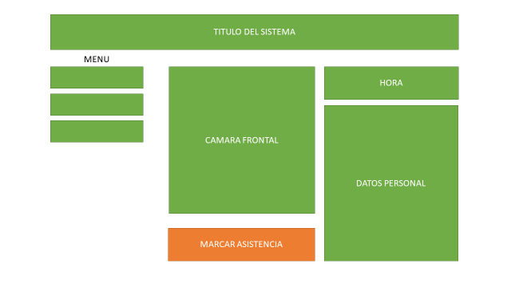
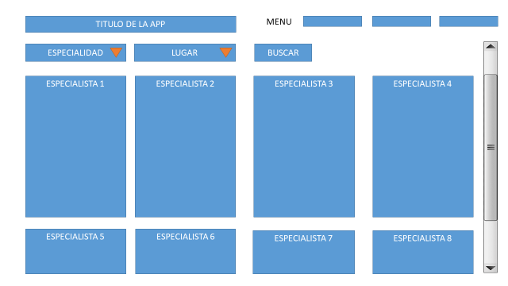

## Idea 1: Sistema de Asistencia por Reconocimiento Facial

**Brief** 💡  
Este proyecto consiste en crear una aplicación web para gestionar la asistencia de empleados o estudiantes mediante reconocimiento facial. Los administradores podrán registrar los rostros de los usuarios, y cada vez que se realice una verificación en tiempo real, el sistema determinará si el rostro corresponde a una persona registrada y automáticamente marcará su asistencia. Este sistema es útil para automatizar la toma de asistencia en entornos laborales o académicos, reduciendo el margen de error y aumentando la eficiencia.

**Fase 1** 🚀  
- **Objetivo**: Crear el sistema básico de registro y gestión de usuarios.
- **Características**:
  - Registro de usuarios con sus datos básicos y fotografía (para entrenamiento del reconocimiento facial).
  - Página de administración para gestionar usuarios.
- **Módulos**:
  - Sistema de registro de usuarios.
  - Base de datos para almacenar información de usuarios y fotos.

**Fase 2** 🚀🚀  
- **Objetivo**: Implementar la funcionalidad de reconocimiento facial.
- **Características**:
  - Módulo de reconocimiento facial.
  - Página para realizar la verificación de la asistencia mediante la cámara.
  - Generación automática de registros de asistencia.
- **Módulos**:
  - Integración de la cámara con el sistema de reconocimiento facial.
  - Verificación en tiempo real de los rostros registrados.
  - Almacenamiento de registros de asistencia en la base de datos.

**Fase 3** 🚀🚀🚀  
- **Objetivo**: Crear reportes y visualizaciones de asistencia.
- **Características**:
  - Página de reportes para que los administradores puedan ver la asistencia de los usuarios.
  - Filtros para ver asistencia por fecha, usuario, etc.
  - Exportar reportes en formatos como CSV o PDF.
- **Módulos**:
  - Generación de gráficos y tablas con los datos de asistencia.
  - Funcionalidad de exportación de datos.

**Layout básico** 🖼️
- Página principal: Registro de usuarios, verificación de asistencia (con acceso a la cámara).

---

## Idea 2: Marketplace de Servicios de Belleza a Domicilio

**Brief** 💡  
Este proyecto consiste en crear una plataforma en línea que conecta a profesionales de la belleza (peluqueros, maquilladores, expertos en cuidado de uñas) con clientes que desean recibir estos servicios en la comodidad de su hogar. La plataforma permitirá a los usuarios buscar y contratar profesionales según sus necesidades, mientras que los proveedores de servicios podrán gestionar sus perfiles y reservas.

**Fase 1** 🚀  
- **Objetivo**: Crear el sistema básico de perfiles y listado de servicios.
- **Características**:
  - Registro de profesionales y clientes.
  - Creación de perfiles para profesionales con sus servicios, precios y disponibilidad.
  - Página de búsqueda de profesionales por ubicación y tipo de servicio.
- **Módulos**:
  - Sistema de autenticación para profesionales y clientes.
  - Base de datos para almacenar información de usuarios y servicios.
  - Motor de búsqueda y filtrado de profesionales.

**Fase 2** 🚀🚀  
- **Objetivo**: Implementar funcionalidades de reservas y pagos.
- **Características**:
  - Sistema de reservas y programación de citas.
  - Integración de pagos en línea para contratar servicios.
  - Funcionalidad de mensajería para comunicación entre clientes y profesionales.
- **Módulos**:
  - Sistema de reservas y gestión de citas.
  - Pasarela de pagos y confirmaciones de reserva.
  - Sistema de mensajería y notificaciones.

**Fase 3** 🚀🚀🚀  
- **Objetivo**: Mejorar la experiencia de usuario con reseñas y recomendaciones.
- **Características**:
  - Sistema de reseñas y calificaciones para servicios y profesionales.
  - Página de perfil detallada con estadísticas y portafolio.
  - Algoritmo de recomendaciones basado en historial de búsqueda y preferencias.
- **Módulos**:
  - Funcionalidad de reseñas y calificaciones.
  - Página de perfil con portafolio y estadísticas.
  - Sistema de recomendaciones personalizadas.

**Layout básico** 🖼️
- Página principal: Búsqueda de profesionales y servicios.

